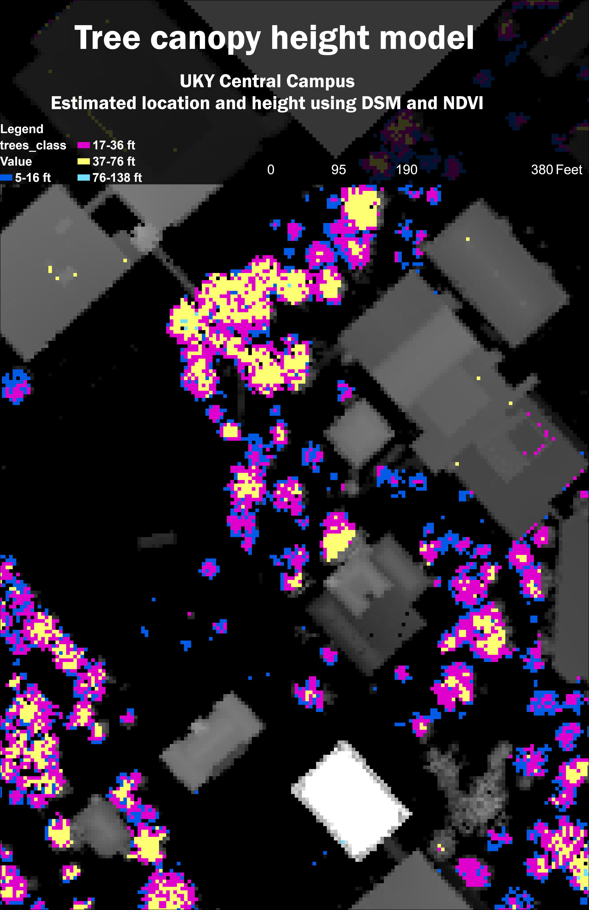

# Kelsey's Web Page
Selected maps of Kentucky and locations therein
https://github.com/kelsmckinney/geo409-field-trip-maps.git
# GEO409 Field Trip Maps

Maps for field trip to measure tree canopy

  
Kentucky counties with selected land cover types – [Download geospatial PDF](kylanduse.pdf)

  
UKy central campus canopy model – [Download geospatial PDF](tree-canopy.pdf)

Maps created by kelsmckinney for GEO409, Spring 2025, University of Kentucky Department of Geography
